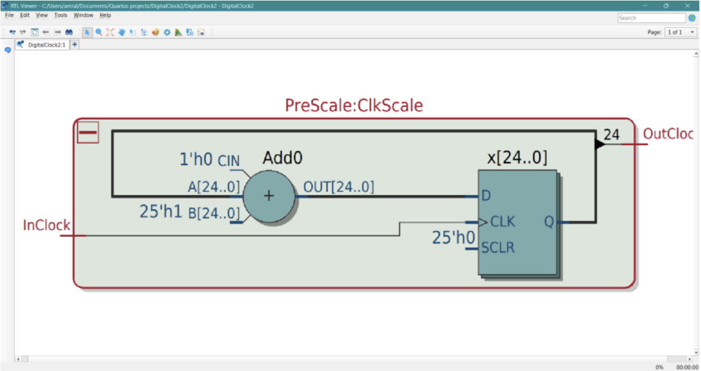
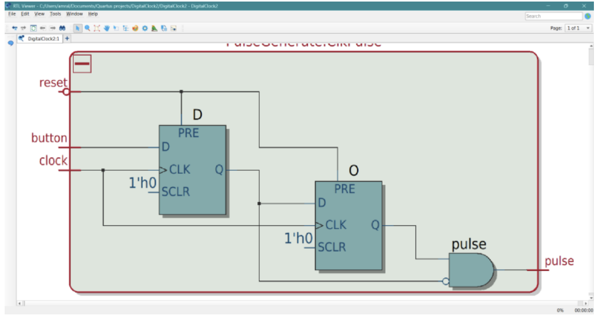
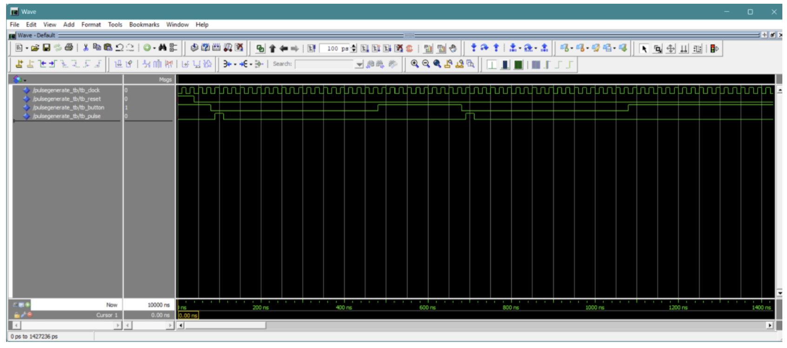

**Clock and Input Handling**

## PreScale Module

This digital alarm uses a **PreScale** module that takes the standard 50 MHz board clock and slows it down into a steady, approximate 1-second pulse. 

* **Implementation:** Built using a 25-bit counter that divides the master frequency down. 
* **Operation:** It counts until the highest bits flip, generating a 1-second pulse that the entire clock system revolves around.
* **Design Choice:** A 25-bit counter was selected because it provides a division factor of $2^{25}$, which is the closest whole-number power-of-two division to the desired 1-second interval.

*Figure 1: RTL block diagram of PreScale, showing a 25-bit adder connected to a flip-flop where the 25th bit feeds the output to achieve a ~1 Hz scaled clock.*

---

## Pulse Generate Module

The system also features a pulse generation system designed to take raw, physical button presses and convert them into single-clock pulses. This prevents multiple unwanted increments caused by a single button press. 

* **The Problem:** When a physical FPGA button is pressed, millions of clock cycles pass even within a single millisecond, causing erratic multi-counting.
* **The Solution:** Built using a two-stage shift register and active-low logic to detect the exact moment a button transition occurs, outputting a single, clean one-cycle pulse.

*Figure 2: RTL block diagram of PulseGenerate. When an input hits the first flip-flop, the first clock cycle feeds it to the output (making the AND gate output 1). On the next clock cycle, the output passes through the second flip-flop, resetting the AND gate output back to 0, ensuring a high signal for exactly one clock cycle.*

### ModelSim Verification

We tested the `PulseGenerate` module in ModelSim using a custom testbench to verify that the produced pulse remains high for precisely one clock cycle.

*Figure 3: ModelSim waveform testing the PulseGenerate module. The bottom wave is the clean single-cycle output, and the wave directly above it is the raw reading from the button input showing a long, continuous signal being converted into a tight pulse.*
