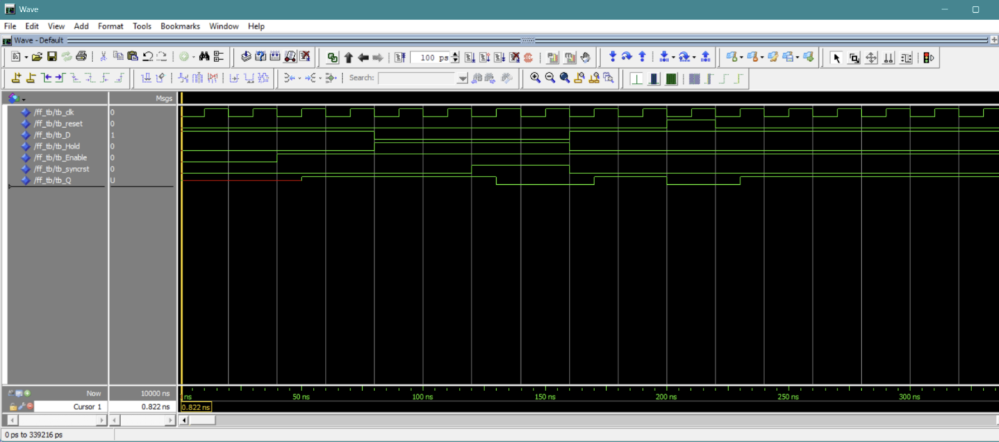
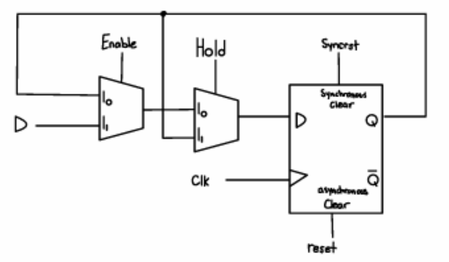
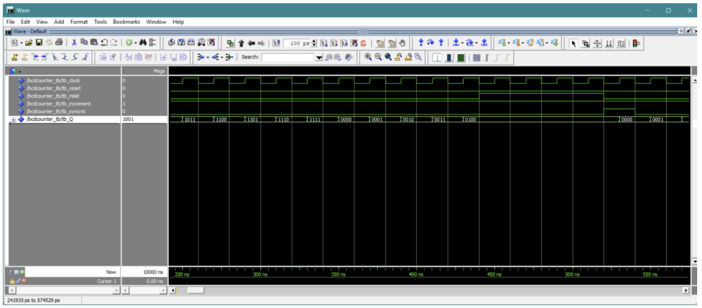
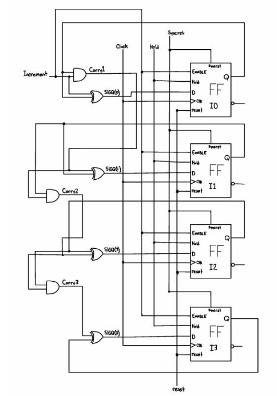
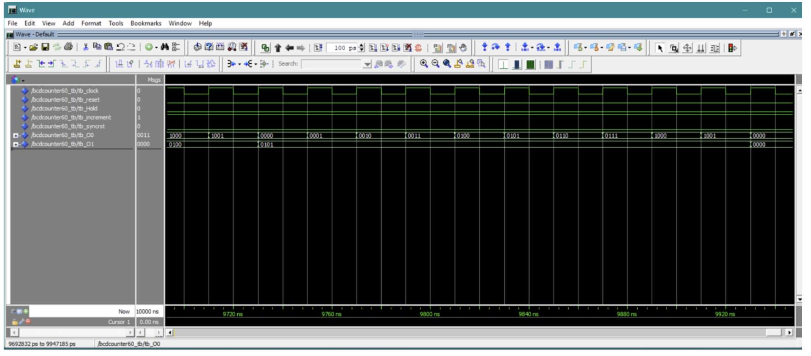
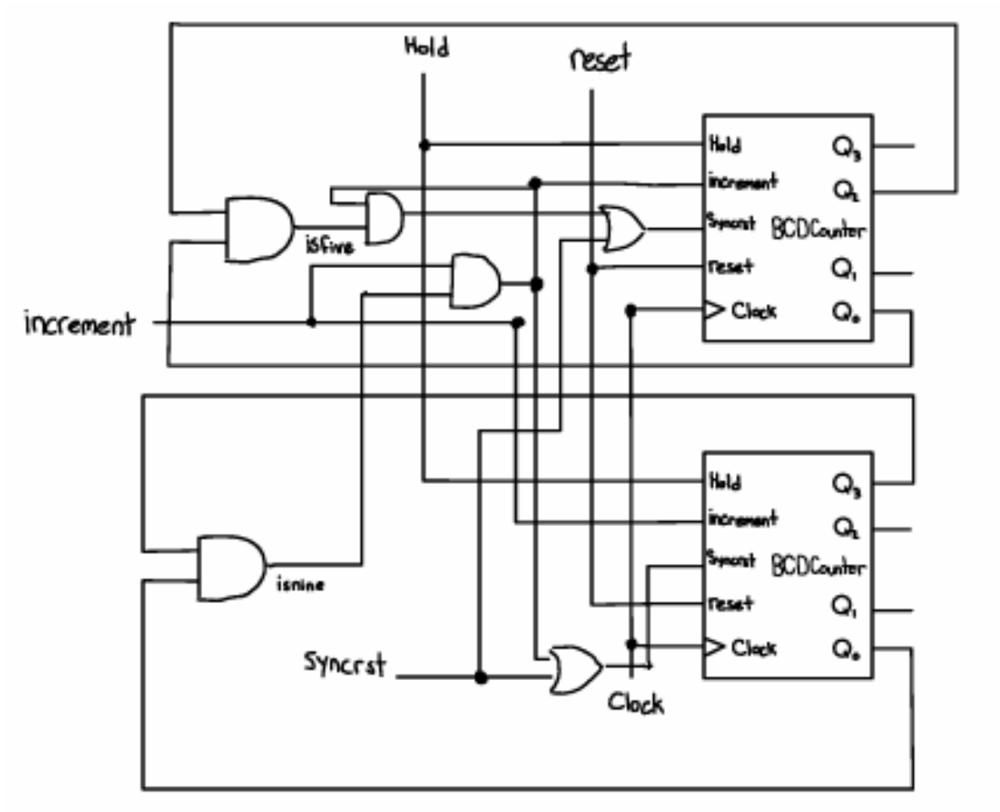
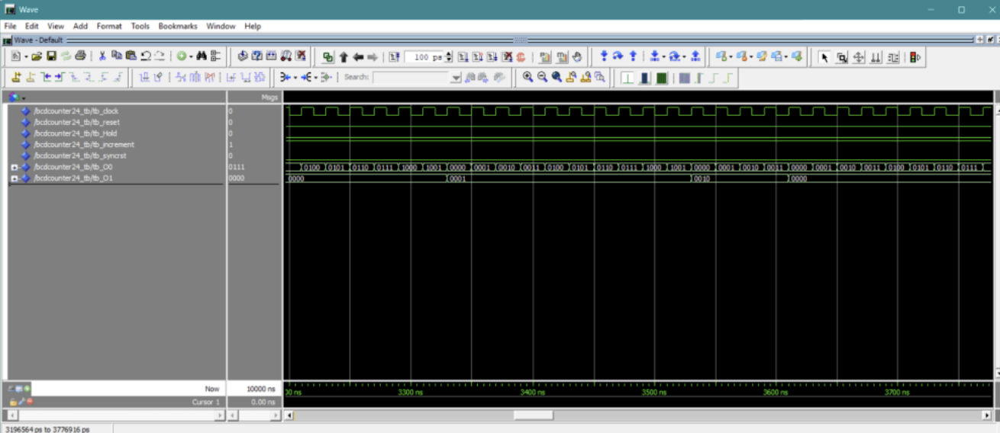
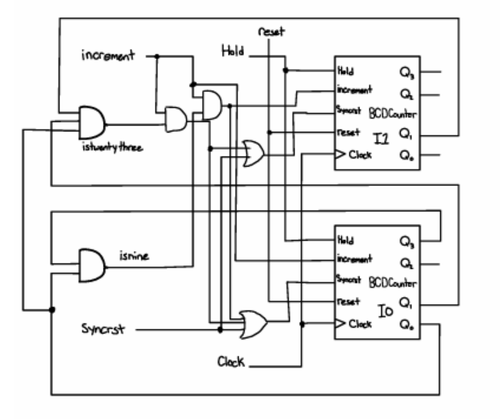
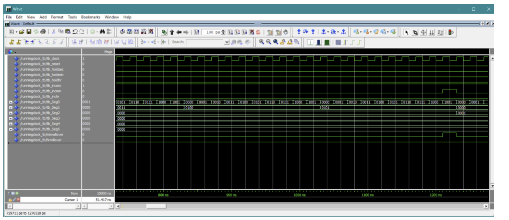
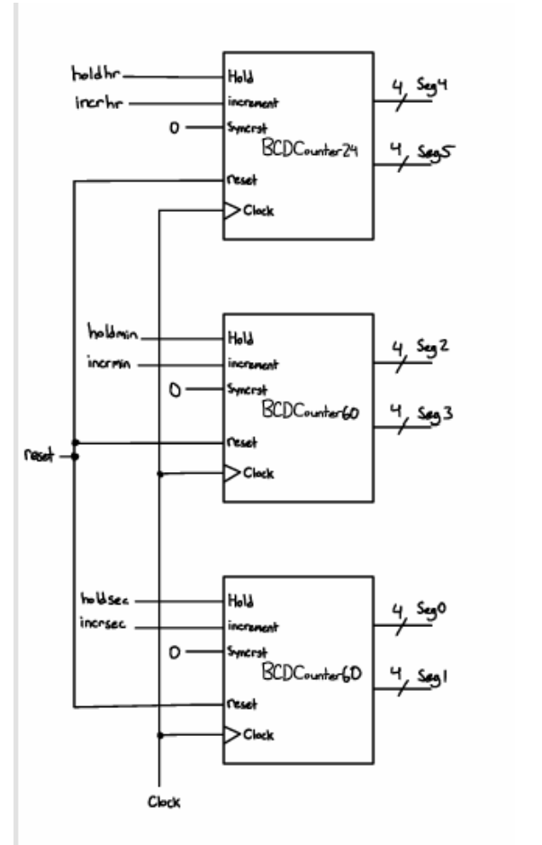

# Display Time Module

This component is responsible for tracking and displaying the real-time (or custom-set) hours, minutes, and seconds. The system relies on a hierarchical structure of **Binary-Coded Decimal (BCD)** counters designed to mimic a standard clock format.

---

## D Flip-Flop Component

The fundamental memory building block of this system is a custom **D flip-flop** featuring hold, enable, and both asynchronous and synchronous reset capabilities. 

* **Design Choice:** A D flip-flop was chosen for simplicity, where the output matches the input on every clock edge.
* **Enable Logic:** Implemented using a multiplexer to control when the flip-flop updates its stored data (controlling when a counter increments).
* **Hold Logic:** A secondary MUX uses the hold signal to decide whether the system retains its current value or passes new data through enable. While hold functionality can technically be achieved by setting `enable = 0` (making hold redundant), it was kept as a separate signal for reusability, readability, and design safety.
* **Resets:** 
  * **Asynchronous Reset:** Used for the system's global "hard reset" functionality, operating independently of the clock.
  * **Synchronous Reset:** Aligned with the clock edge to enable BCD counting logic and proper wraparound values.

### Input Precedence & Verification
We tested the flip-flop in ModelSim to ensure correct input priority: hard reset takes the highest precedence, followed by hold, with enable having the lowest priority.

*Figure 4: ModelSim waveform for the D Flip-Flop demonstrating input priorities (hard reset at the top, hold, enable, and sync reset).*

*Figure 5: Drawn block diagram of the D flip-flop showing MUX integration for enable and hold logic.*

---

## Base Counter (`BCDCounter`)

A 4-bit synchronous counter, `BCDCounter`, was constructed using a carry-chain architecture built by instantiating four of the D flip-flops described above.

* **Gating:** Controlled via an enable/increment signal (counts when high, freezes when low).
* **Carry Chain:** The first flip-flop toggles on every increment signal, while higher bits rely on carry signals generated from previous output values and increment states.
* **Modularity:** This base counter is intentionally a simple 4-bit, 0–15 binary counter *without* built-in BCD wraparound logic to maximize reusability across the project.

*Figure 6: ModelSim waveform for `BCDCounter`, testing synchronous reset (~525ns), wraparound at 15/1111 (~350ns), and hold functionality (440ns to 520ns).*

*Figure 7: Block diagram of `BCDCounter` utilizing four D flip-flops and carry-chain logic.*

---

## BCD Counter 60 (`BCDCounter60`)

This module combines two BCD counters to manage the ones and tens places for both seconds and minutes (0–59 range).

* **Detection Logic:** Uses internal signals (`isfine` and `isnine`) to detect when the ones place reaches 9 and the tens place reaches 5, triggering synchronous resets and cascading increment pulses to higher digits.
* **FPGA Testing:** Tested on the Cyclone V board using the onboard 50 MHz clock scaled down via `PreScale`. Inputs/resets were mapped to physical board keys (`KEY`), and outputs drove `HEX0` and `HEX1` 7-segment displays via `SegDecoder`.

*Figure 8: ModelSim waveform for `BCDCounter60` testing minute increment (~9230ns) and full synchronous reset at 59 (~9930ns).*

*Figure 9: `BCDCounter60` block diagram instantiating two BCDCounters with 59-rollover check logic.*

---

## BCD Counter 24 (`BCDCounter24`)

This module handles the hours portion of the clock, utilizing detection logic to recognize binary conditions equal to `09`, `19`, and `23`.

* **Rollover:** When these conditions are met, the corresponding digits reset to 0, completing a 24-hour cycle when hours reach 23 while receiving rollover inputs from the minute counters.

*Figure 10: ModelSim waveform for `BCDCounter24`, showing tens digit reset (~3360ns) and full synchronous reset at 23 (~3630ns).*

*Figure 11: Block diagram for `BCDCounter24` utilizing 0–24 rollover logic.*

---

## SegDecoder Component

`SegDecoder` is a combinational logic block responsible for translating 4-bit binary inputs into the corresponding 7-bit patterns required to drive physical 7-segment displays. It was used extensively to verify individual BCD counters and render final clock outputs.

---

## Running Clock

The **RunningClock** component integrates all the lower-level counters into a unified, reusable standard clock module.

* **Architecture:** Combines two `BCDCounter60` modules (seconds and minutes) and one `BCDCounter24` module (hours).
* **Control Signals:** Features dedicated inputs for clock, hard reset, hold, and increment signals for each time field, allowing individual manual control or automatic cascading via rollover carry signals.
* **Verification:** Tested successfully in ModelSim and on FPGA hardware, verifying smooth counting from `00:00:00` to `23:59:59` before resetting.

*Figure 12: ModelSim waveform for `RunningClock` testing seconds tens-digit increments (~875ns, ~1075ns) and minute rollovers (~1270ns).*

*Figure 13: Top-level block diagram of `RunningClock` showing isolated control lines for each time value.*
