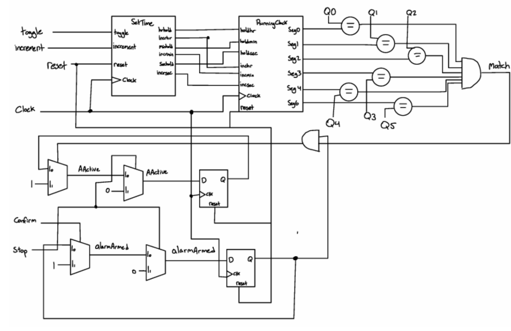

# 2.4 Set Alarm State

The **Set Alarm** state is encapsulated within its own module and serves as the final state in the overall FSM architecture. 

* **Inputs:** 
  * Six 4-bit input signals (`Q0` to `Q5`), mapped to the current time in the top-level entity to allow real-time comparison against the set alarm time.
  * One-bit control signals: `clock`, `reset`, `increment`, `toggle`, `confirm`, and `stop`.
* **Outputs:** 
  * Six 4-bit outputs driving the 7-segment displays.
  * Two 1-bit signal outputs indicating the current state of the alarm.

---

## Architecture & Instantiations

The alarm module instantiates two key components:
1. **`RunningClock`**: Used for storage of the user-configured alarm time.
2. **`SetTime`**: Provides the interactive functionality needed to adjust and set the desired alarm time.

### Comparator & Match Logic
A comparator checks for equality using a `Match` signal. This signal is driven high (`1`) whenever each of the output values from the `RunningClock` instantiation (holding the target alarm time) exactly matches the current time inputs.

---

## Alarm Control Processes

The module relies on two primary sequential processes:

### 1. Arming and Disarming Logic
* **Hard Reset:** Defaults the `armed` signal to `0`.
* **Stop Signal:** If the stop signal goes high, it immediately disarms the alarm by setting `armed` to `0`.
* **Confirm Button:** If a signal is received from the confirm button, it arms the alarm by setting the respective signal high.

### 2. Triggering and Active State (`AActive`)
* **Trigger Condition:** Checks continuously if the alarm is **armed** *and* if the current time matches the alarm time (`Match == 1`). When both conditions are met, the alarm triggers, driving the `AActive` signal high.
* **Disarm/Stop Trigger:** If an active alarm is ringing, receiving a stop signal turns off the active state.

---

## Signal Routing & FPGA Button Logic

The internal instantiations of `SetTime` and `RunningClock` coordinate the alarm setting configuration:
* `SetTime` maps `reset`, `clock`, `increment`, and `toggle` directly to the corresponding inputs of the `Alarm` VHDL file.
* Hold and increment output signals from `SetTime` are routed through internal signals declared within `Alarm.vhd` into the `RunningClock` instance.
* The stored time is output to the 7-segment display drivers and fed into the comparator logic.

> **Hardware Note:** The `reset` port mapping from `SetTime` is explicitly mapped to the **NOT reset** of the alarm file. This is intentional to account for the active-low nature of the physical buttons on the FPGA board.

---

## Verification

With the alarm module finalized, all core components of the digital clock system were complete, allowing for full system-level integration and hardware verification on the FPGA.

*Figure 17: Block diagram for `Alarm.vhd`, illustrating the integration of `SetTime` and `RunningClock`, comparators, and MUXes used to manage alarm states, armed flags, and active triggers.*
