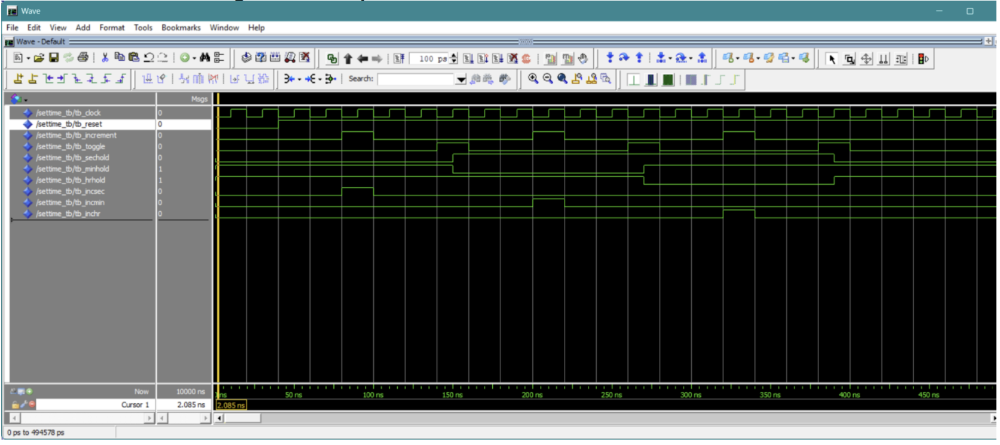
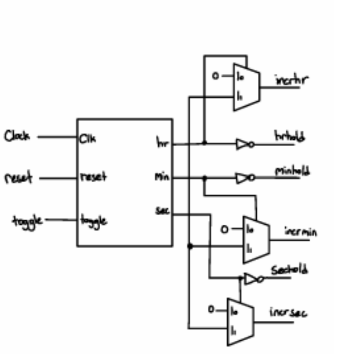
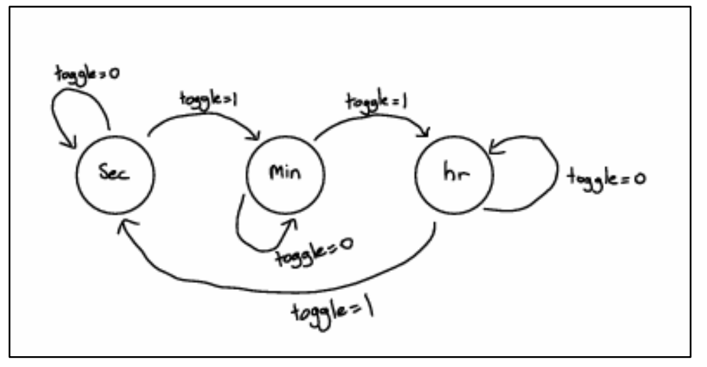

# 2.3 Set Time State

The **Set Time** mode is built around a synchronous finite state machine (FSM) to handle manual time configuration. The FSM enables the system to track its current configuration mode and switch between setting different time values.

* **State Cycling:** Cycles through three primary states using an edge-toggled button: **edit seconds $\rightarrow$ edit minutes $\rightarrow$ edit hours $\rightarrow$ seconds**.
* **Signal Routing:** In each state, the increment pulse input is routed exclusively to the active value being edited, while all other values are frozen. 
* **Failsafe Design:** The freeze (hold) mechanism acts as a failsafe to prevent unwanted increments on non-active fields.
* **Toggle Trigger:** On every rising edge of the main clock when the toggle signal pulse is high, the state advances to the next time field.

---

## Signal Control & Logic

The FSM controls the output control signals (hold and increment) based on the active state:
* **Increment Routing:** The input increment signal maps to `incsec` only when in the seconds state (and `0` otherwise), ensuring seconds is the only value that can increment. Similar logic applies to `incmin` and `inchr`.
* **Hold Management:** Each field's hold signal is set to `0` (no hold) only when the system is in the state that modifies that specific value.

---

## ModelSim Verification & Diagrams

Since this module primarily manages signal routing and state transitions, it was tested using a ModelSim testbench to observe correct signal outputs across all states.

*Figure 14: ModelSim waveform for `SetTime`. At 80ns (seconds state), forcing increment high drives `incsec` high while other values are held (`minhold` and `hrhold` forced high). When a toggle occurs at 140ns, `sechold` goes high and `minhold` goes low; forcing increment at 200ns activates `incmin`. Hours behavior is tested after the subsequent toggle at 260ns.*

*Figure 15: RTL block diagram for `SetTime` utilizing MUXes and inverters to manage output control signals.*

*Figure 16: State diagram for `SetTime` showing state transitions and control signal routing.*

---

## State Table

The following state table defines the current states, next states (for `Toggle = 0` and `Toggle = 1`), and resulting control outputs (assuming `Toggle = 1` for outputs):

| Current State | Next State (`Toggle = 0`) | Next State' (`Toggle = 1`) | `Sechold` | `Minhold` | `Hrhold` | `Incsec` | `Incmin` | `Inchr` |
| :--- | :--- | :--- | :---: | :---: | :---: | :---: | :---: | :---: |
| **sec** | sec | min | 1 | 0 | 1 | 0 | 1 | 0 |
| **min** | min | hr | 1 | 1 | 0 | 0 | 0 | 1 |
| **hr** | hr | sec | 0 | 1 | 1 | 1 | 0 | 0 |
