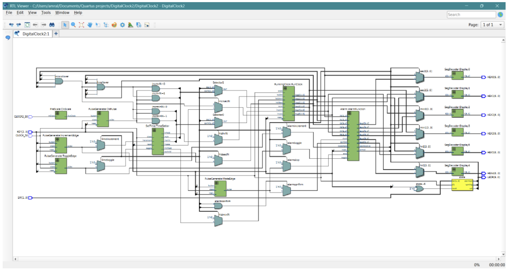
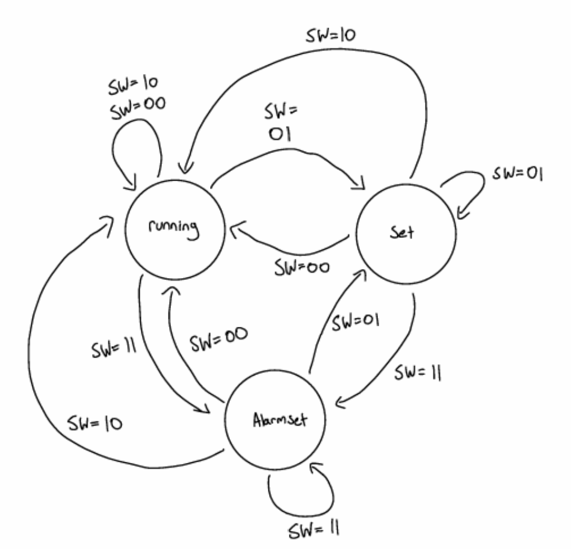

# Top-level AlarmClock FSM

For the top-level entity, all previous files and modules are combined into a single master file to create a fully functional alarm clock finite state machine. 

* **Inputs:** `KEY3` down to `KEY0`, switches `SW1` and `SW0`, and two on-board clocks.
* **Outputs:** Six 7-segment displays and all ten on-board LEDs.

---

## Clock Architecture

The system declares two clocks but runs primarily on one main clock:
* **`CLOCK_50`:** The main 50 MHz board clock that drives the high-speed system operations.
* **`CLOCK2_50`:** A secondary clock port scaled down using the `PreScale` entity to generate a clean pulse signal rather than acting as a standard clock driver.

---

## State Machine & Switch Control

The main architecture relies on three states (`running`, `set`, and `alarmset`), declared as a custom `state_type` signal. 

* **Switch Mapping (`SW1`, `SW0`):**
  * `00` $\rightarrow$ `running`
  * `01` $\rightarrow$ `set`
  * `11` $\rightarrow$ `alarmset`
  * `10` (Fourth, don't-care state) $\rightarrow$ Defaults to `running`.
* **Instantaneous Transitions:** Switch positions are evaluated on every cycle of the fast 50 MHz clock, allowing the system to change states almost instantaneously when the user flips the switches.

---

## Display Routing & LED Indicators

### 7-Segment Multiplexing
For each digit across seconds, minutes, and hours, there are three internal carry signals (alarm time, current time, and final display value). A MUX-style statement uses the current state as a control input: the displays show the **alarm time** exclusively when in the `alarmset` state, and otherwise display the active time.

### LED Status Indicators
* **`LED0`:** High when in `running` state.
* **`LED1`:** High when in `set` state.
* **`LED2`:** High when in `alarmset` state.
* **`LED3`:** High when the alarm is armed.
* **`LED4` – `LED9` (Remaining 5 LEDs):** Set high if the alarm triggers. They remain lit until either the stop button (`KEY0`) is pressed or a master hard reset (`KEY3`) is executed.

---

## Button Signal Routing & Safety Logic

Since setting the time and setting the alarm share similar buttons for toggling and incrementing, signal routing is managed dynamically based on state:
* **Set Time/Alarm Buttons:** `KEY2` (toggle) and `KEY1` (increment) are dynamically assigned to either the `set` module or the `alarmset` module depending on the active state.
* **Confirm & Stop Signals:** 
  * `KEY0` acts as the confirm signal only when in `alarmset`.
  * The stop/disarm condition allows the user to disarm the alarm from *any* state, provided the alarm is already armed, preventing accidental or unwanted alarm configurations.

---

## Main Controller & Increment/Hold Logic

The master controller process assigns control signals based on the active state:

* **`running` State:** All hold signals are set to `0` to allow free-running incrementing. Seconds increment every tick via `ClockPulse` from `PreScale`, while minutes and hours increment via rollover carry logic (e.g., minutes increment when seconds reach `59`).
* **`set` State:** Increment and hold signals are mapped directly to the outputs of the `SetTime` instantiation, driven by physical keys `KEY1` and `KEY2`. Upon exiting `set`, the clock continues ticking normally from the newly configured time.
* **`alarmset` State:** Increment and hold values match the `running` state behavior. This ensures the background clock continues to run uninterrupted while the independent alarm time is viewed and adjusted.

All raw button inputs and the slow clock pass through `PulseGenerate` instances to produce clean, single-cycle pulses and prevent erratic multi-counting.

---

## Component Instantiations

The top-level architecture instantiates:
* **`PreScale`** (x1): Generates the slow clock pulse.
* **`PulseGenerate`** (x4): Cleans input signals from buttons and clock pulses.
* **`SetTime`** (x1): Manages time and alarm setting logic.
* **`RunningClock`** (x1): Maintains the active time and stored alarm registers.
* **`Alarm`** (x1): Manages comparison logic, arming states, and trigger flags.
* **`SegDecoder`** (x6): Decodes 4-bit binary values into base-10 7-segment display outputs.

> **Master Reset:** `KEY3` serves as the global hard reset, instantly returning the entire system—including current time, set times, and alarms—back to the default `00:00:00` state.

---

## Diagrams & Reference Tables

*Figure 18: RTL block diagram of `AlarmClock`, showing internal carry logic, MUXes, and component instantiations.*

*Figure 19: State diagram of the master `AlarmClock` system, illustrating bidirectional state transitions governed by switches `SW0` and `SW1`.*

### State & Control Tables

**Table 2: Top-Level FSM State Table**
| Current State | Next State (`SW = 00`) | Next State (`SW = 01`) | Next State (`SW = 10`) | Next State (`SW = 11`) |
| :--- | :---: | :---: | :---: | :---: |
| **running** | running | set | running | alarmset |
| **set** | running | set | running | alarmset |
| **alarmset** | running | set | running | alarmset |

**Table 3: Increment and Hold Assignments Based on State**
| Current State | `incrsecIN` | `incrminIN` | `incrhrIN` | `hldsecIN` | `hldminIN` | `hldhrIN` |
| :--- | :--- | :--- | :--- | :---: | :---: | :---: |
| **running** | `ClockPulse` | `ClockPulse` AND `minrollover` | `ClockPulse` AND `hrrollover` | 0 | 0 | 0 |
| **set** | `incrsecOUT` | `incrminOUT` | `incrhrOUT` | `hldsecOUT` | `hldminOUT` | `hldhrOUT` |
| **alarmset** | `ClockPulse` | `ClockPulse` AND `minrollover` | `ClockPulse` AND `hrrollover` | 0 | 0 | 0 |
